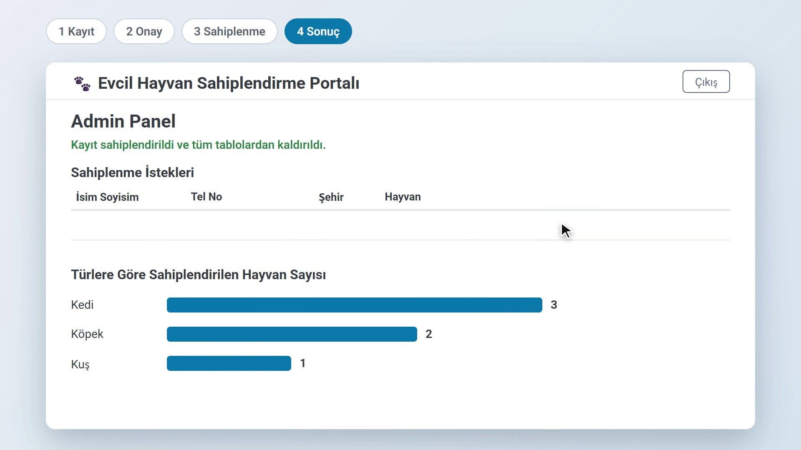

# Evcil Hayvan Sahiplendirme Portalı

[](https://github.com/s0shaw/pet-adoption-app/actions/workflows/ci.yml)



Evcil hayvan sahiplendirme sürecini yöneten bir masaüstü uygulaması. Sahiplendirmek isteyenler hayvan bilgisini gönderir, admin onaylar, sahiplenmek isteyenler onaylı hayvanlar için talepte bulunur, admin talebi kabul eder veya reddeder.

Bu proje 2024'te okul ödevi olarak WinForms + SQL Server ile yazıldı. Sonradan kısaca yenilenip açık kaynak yapıldı: aynı özelliklerle Electron + C# + SQLite olarak yeniden yazıldı.

*English: a 2024 school project (WinForms + SQL Server), briefly modernized and open-sourced as an Electron + ASP.NET Core + SQLite desktop app.*

## Mimari

```
app/
  api/   ASP.NET Core minimal API (.NET 8), EF Core, SQLite, xUnit testleri
  ui/    Electron + düz HTML/CSS/JS
```

Electron açılınca C# API'yi yalnızca `127.0.0.1` üzerinde, boş bir porttan başlatır. Her açılışta üretilen rastgele bir token olmadan API istekleri 401 döner. Veriler `%APPDATA%/PetAdoption/petadoption.db` dosyasında tutulur, ek kurulum gerekmez.

## Gereksinimler

- .NET SDK 8 veya üstü
- Node.js 20 veya üstü

## Çalıştırma

```bash
cd app/ui
npm install
npm start
```

`npm start` önce API'yi derler, sonra uygulamayı açar.

## Test

```bash
dotnet test app/api/PetAdoption.Api.Tests
```

## Kullanım

- **Admin:** kullanıcı adı `admin`, şifre `admin`. Bu yalnızca demo içindir; gerçek kullanımda `app/api/PetAdoption.Api/appsettings.json` içinde değiştirin. Hayvan kayıtlarını ve sahiplenme taleplerini yönetir.
- **Sahiplendiren:** ad soyad ile girer, hayvan bilgilerini doldurup admin'e istek gönderir.
- **Sahiplenen:** ad soyad ile girer, onaylı hayvanlardan seçip talep gönderir.

Admin bir talebi kabul ettiğinde hayvan ve o hayvana yapılmış tüm talepler silinir.

## Lisans

[MIT](LICENSE)
